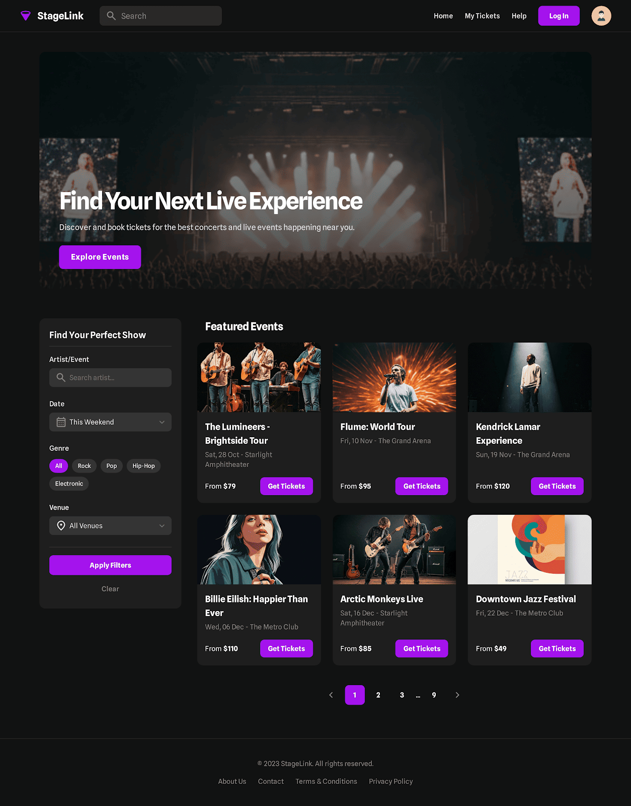
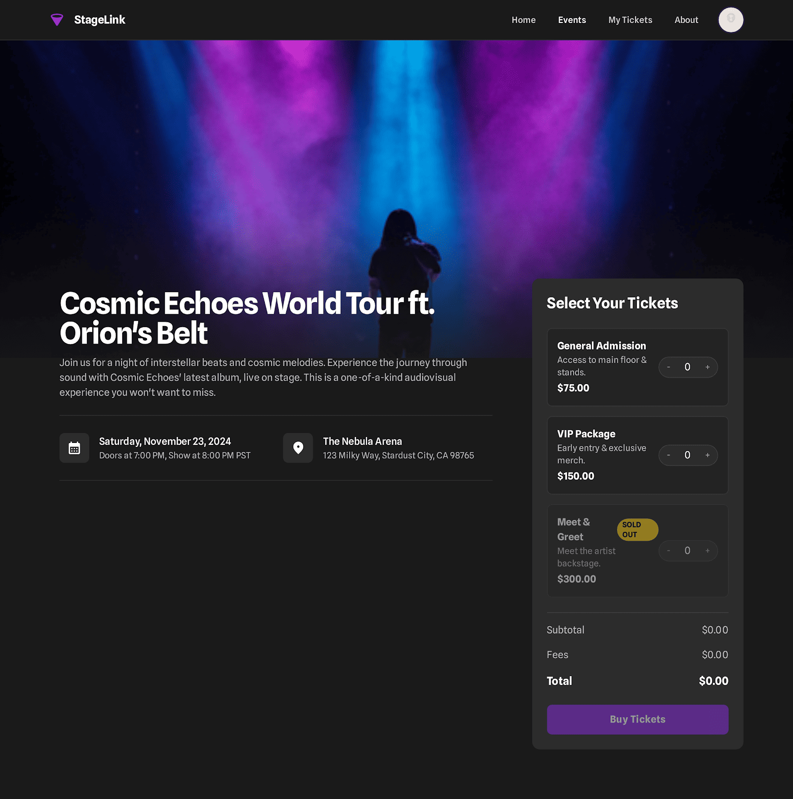
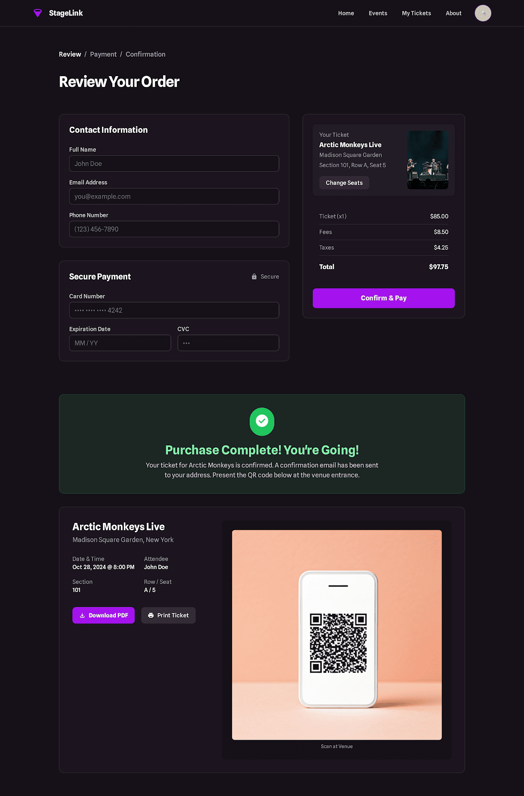

# 🎟️ StageLink

**A modern, frontend-first concert ticketing experience.**

StageLink is a React-based application designed to simulate a complete e-commerce flow for live events. While the product is a ticketing platform, the technical goal is to demonstrate **clean frontend architecture**, robust **state management**, and a seamless **UX/UI** implementation.

> **⚠️ Note:** This is a portfolio project using a mocked backend and local persistence. No real payments are processed.

## 🎨 Design & Inspiration

The UI inspired by the **Stitch design** to ensure visual consistency and accessibility.
[View Design Prototype (Stitch)](https://stitch.withgoogle.com/projects/7174623962662235921)

## Screenshots (Stitch design)

[](./docs/design/home.png "Open full size")  
_Home Page_

[](./docs/design/event-detail.png "Open full size")  
_Event Detail Page_

[](./docs/design/cart-checkout.png "Open full size")  
_Checkout Page_

## ✨ Key Features (MVP)

- **Event Discovery:** Browse and filter events with instant search capabilities.
- **Smart Booking:** Select ticket types and manage quantities dynamically.
- **Persistent Cart:** Review and edit orders with state persistence (via `localStorage`).
- **Simulated Checkout:** A friction-free purchase flow that generates ticket IDs without real transactions.
- **My Tickets:** View your purchased tickets in a digital wallet format.

## 🛠️ Tech Stack

- **Core:** React + Vite
- **Routing:** React Router (SPA)
- **Data:** Mocked Local JSON (simulating REST API)
- **State/Storage:** Custom Hooks + LocalStorage API

## 🚀 Getting Started

Follow these steps to run the project locally:

### Install dependencies

```bash
pnpm install
# or npm install
```

### Run the development server

```bash
pnpm dev
# or npm run dev
```

## 🚧 Project Status

Current Phase: MVP / Frontend Implementation.
The project currently operates with a mocked backend to focus on UI/UX interactions. Future updates will introduce a real API integration under /server within this repository.

## Author:

Carlos Marte

Github: https://github.com/carlosmarte23

## License

MIT
