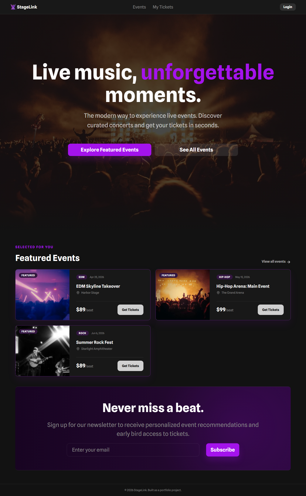
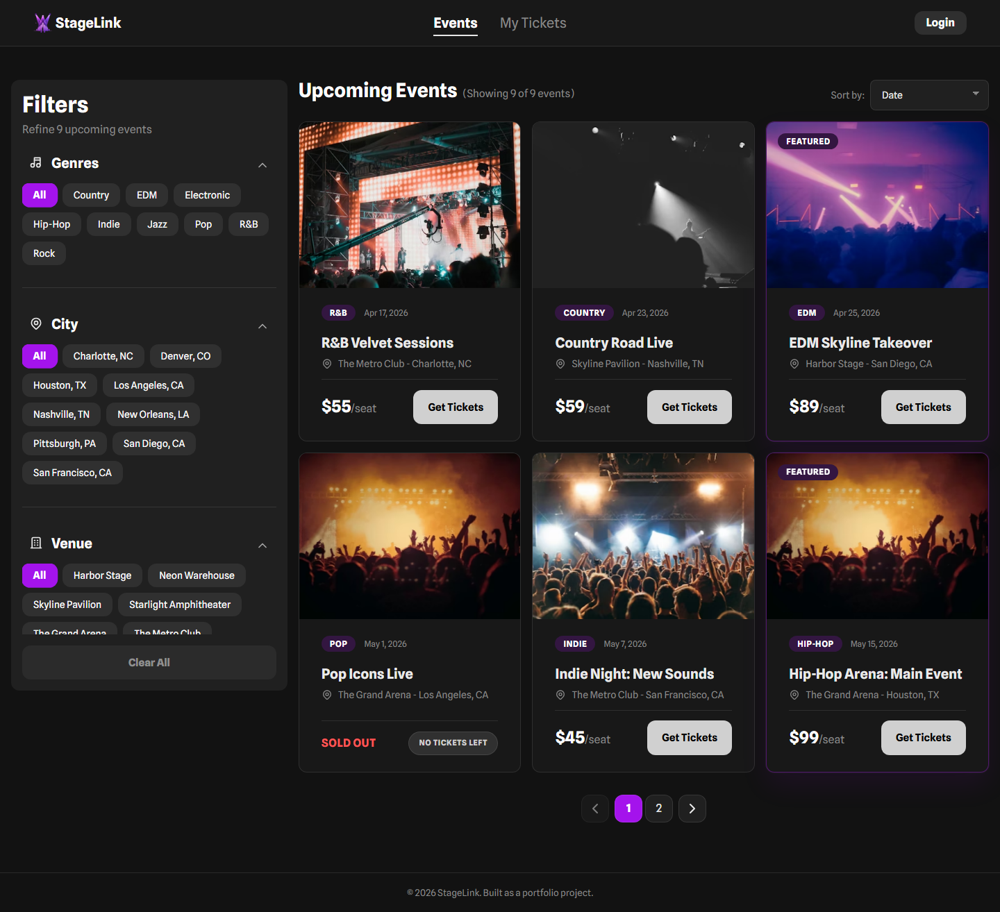
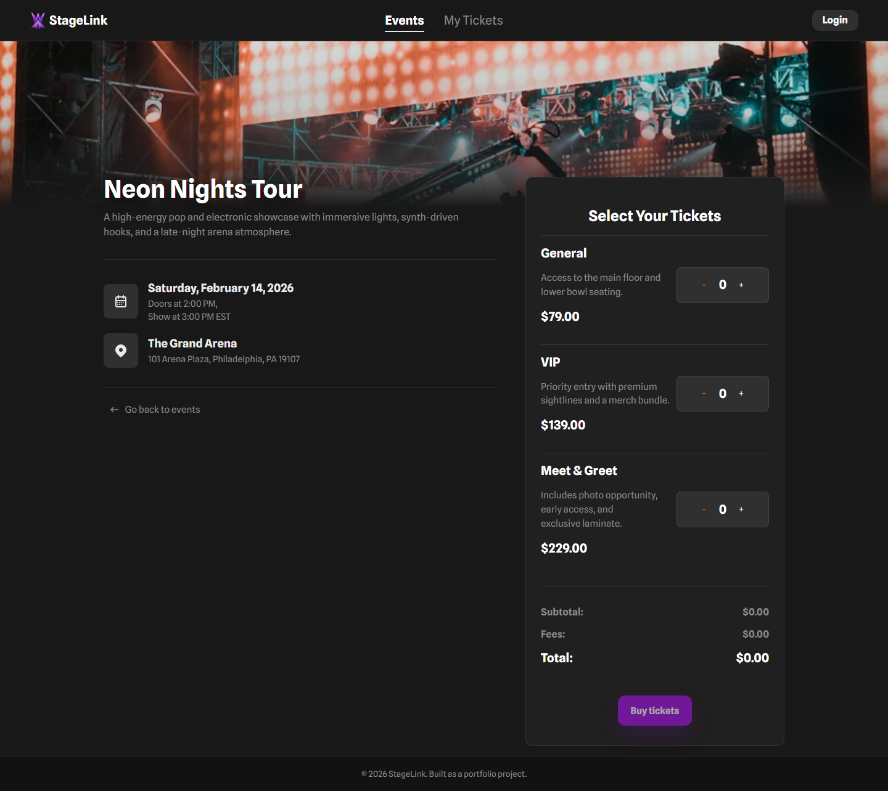

# 🎟️ StageLink

**A modern, frontend-first concert ticketing experience.**

StageLink is a React-based application that simulates a concert ticketing flow with mocked data and local persistence. The project focuses on clean frontend architecture, reusable UI, deterministic tests, and a realistic browse-to-cart user experience.

> **⚠️ Note:** This is a portfolio project using a mocked backend and browser storage. No real payments are processed.

## 🎨 Design & Inspiration

The UI is inspired by the Stitch design pack to keep the product experience visually consistent across the public ticketing flow.

[View Design Prototype (Stitch)](https://stitch.withgoogle.com/projects/7174623962662235921)

## Implemented App Screenshots

[](./docs/screenshots/home.png "Open full size")
_Home Page_

[](./docs/screenshots/events.png "Open full size")
_Events Page_

[](./docs/screenshots/event-detail.png "Open full size")
_Event Detail Page_

## Checkout Design (Stitch)

[](./docs/design/cart-checkout-review.png "Open full size")
_Checkout Review Step_

## ✨ Key Features (MVP)

- **Event Discovery:** Browse the event catalog with filters, sorting, pagination, and empty states.
- **Canonical Event Data:** Home, Events, and Event Detail share one event contract through repository/selectors.
- **Ticket Selection:** Select variable ticket tiers, respect per-tier limits, and handle sold-out tiers.
- **Persistent Cart:** Add event ticket selections to a local cart using `localStorage`.
- **Testing Foundation:** Vitest and React Testing Library cover shared utilities, components, and page-level flows.
- **Simulated Checkout:** Design-first checkout plan for a premium single-page flow with a centered step panel and no real transactions.
- **My Tickets:** Planned digital ticket wallet fed by generated local tickets.

## 🧭 Project Status

Current phase: MVP frontend implementation.

Completed:

- Home page UI
- Events listing UI
- Event Detail UI
- Add-to-cart persistence
- Frontend testing setup and initial regression coverage

In progress:

- Cart / Checkout design definition and milestone planning

Planned:

- Cart / Checkout implementation
- My Tickets UI
- Auth UI
- Admin UI
- Final responsive and accessibility polish

## 📚 Documentation

- [Frontend Roadmap](./docs/ROADMAP_FRONTEND.md)
- [Testing Foundations](./docs/milestones/TESTING_FOUNDATIONS.md)
- [Home UI Milestone](./docs/milestones/MILESTONE_HOME_UI.md)
- [Events UI Milestone](./docs/milestones/MILESTONE_EVENTS_UI.md)
- [Event Detail UI Milestone](./docs/milestones/MILESTONE_EVENT_DETAIL_UI.md)
- [Cart / Checkout UI Milestone](./docs/milestones/MILESTONE_CART_CHECKOUT_UI.md)

## 🛠️ Tech Stack

- **Core:** React + Vite
- **Routing:** React Router
- **Data:** Mocked local JSON
- **State/Storage:** React state + LocalStorage API
- **Tests:** Vitest + React Testing Library + jest-dom + user-event + jsdom

## 🚀 Getting Started

### Install dependencies

```bash
pnpm install
```

### Run the development server

```bash
pnpm dev
```

### Run checks

```bash
pnpm test:run
pnpm lint
```

## Author

Carlos Marte

GitHub: https://github.com/carlosmarte23

## License

MIT
