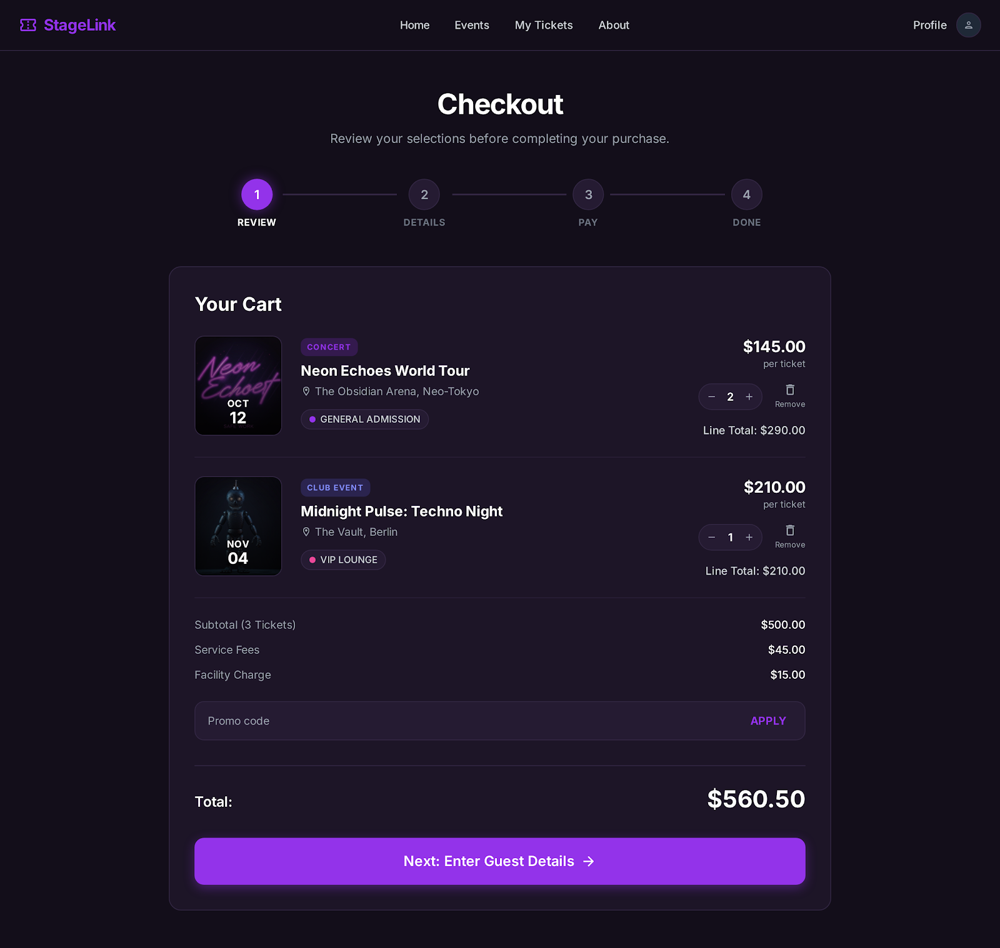
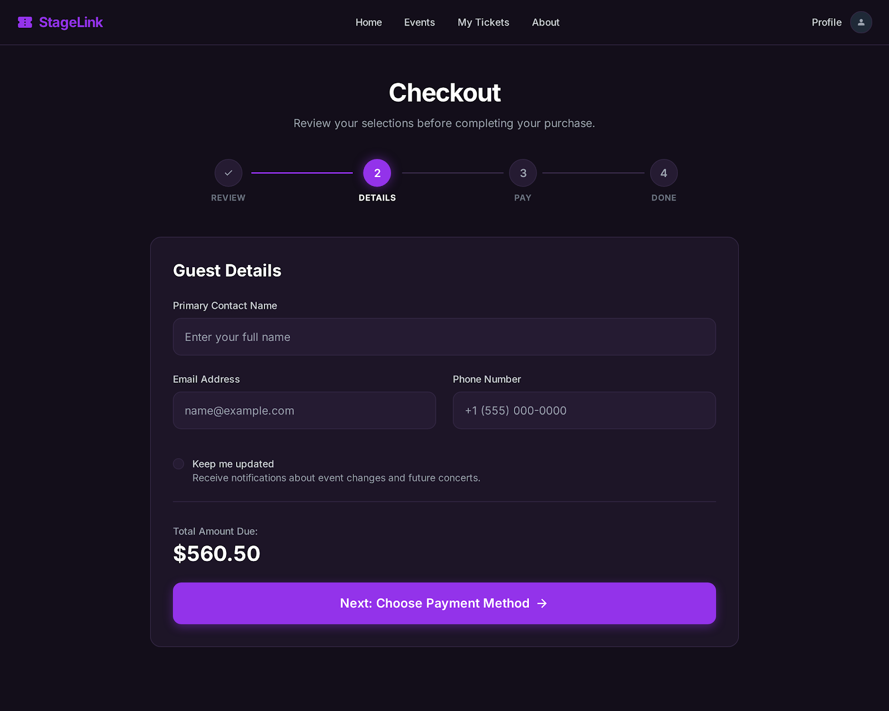
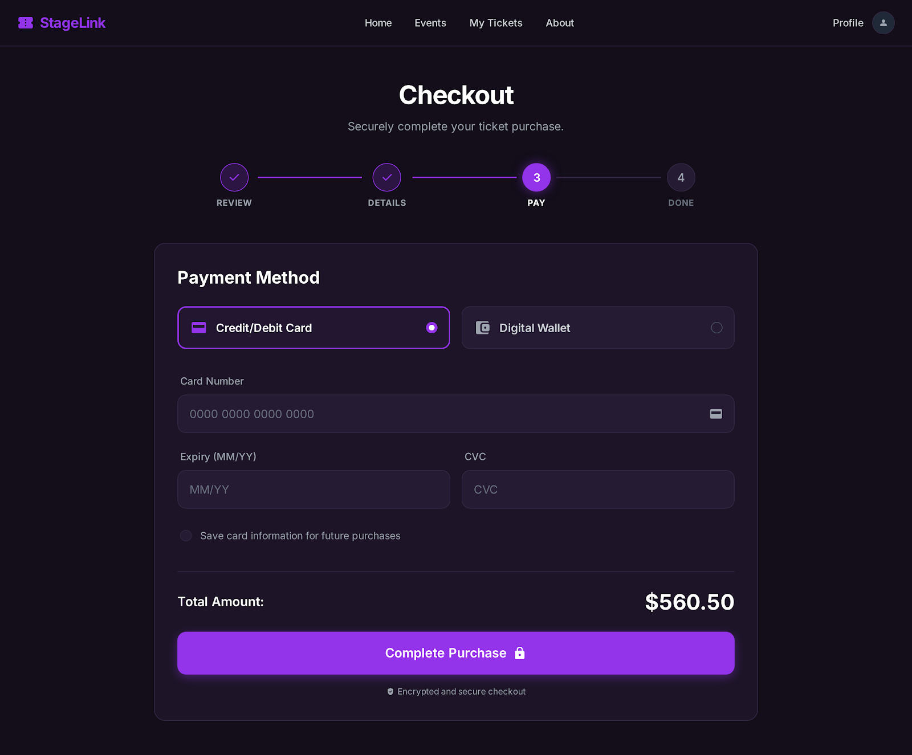
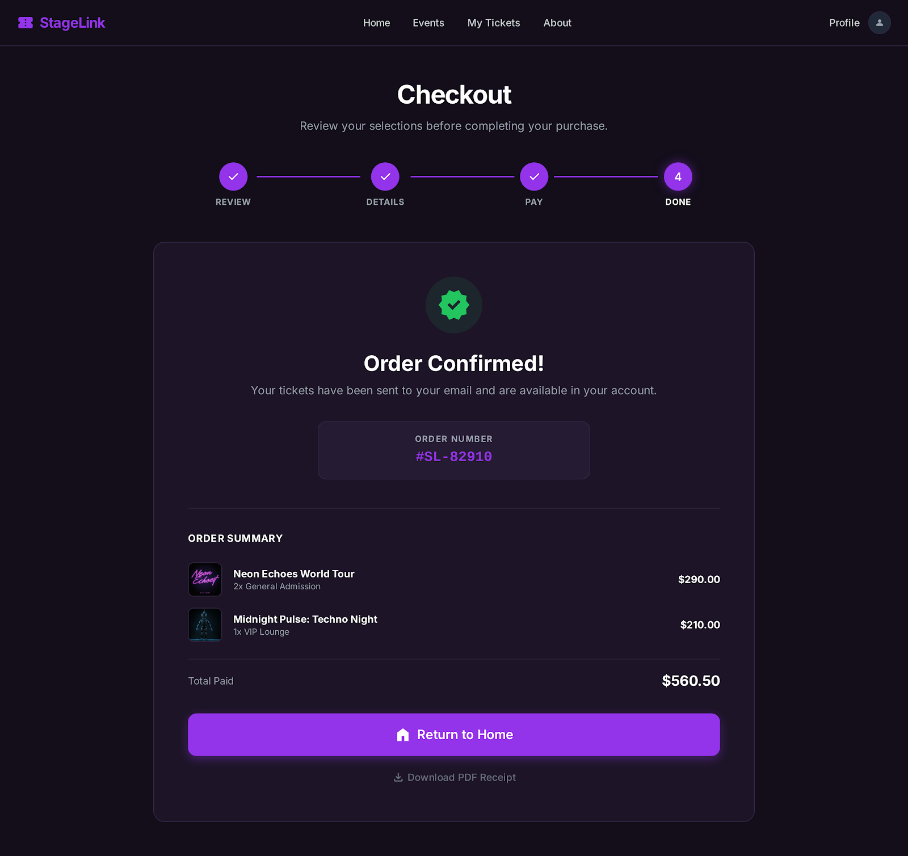

# Milestone: Cart / Checkout UI

Target screen

- Stitch Checkout: premium single-page checkout with a top progress timeline and centered step panel for Review, Details, Pay, and Done

Goal

Build the `/cart` page as a polished frontend-only checkout experience for StageLink. The page should support multiple events in one cart, show every purchased ticket tier inside its event group, guide the customer through a clear step flow, and complete with a local confirmation handoff to My Tickets.

Non-goals (not in this milestone)

- No real payment provider integration
- No backend order API
- No live inventory reservation
- No saved payment methods
- No refunds, cancellations, or email delivery
- No full My Tickets implementation beyond the checkout handoff

## Stitch Design

_Review step_

_Details step_

_Pay step_

_Done step_

## Design Direction

### Visual direction

- Premium dark ticketing checkout
- Centered single-page checkout panel
- Top progress timeline as the main navigation anchor
- Four steps: Review, Details, Pay, Done
- Multi-event cart support
- Every selected tier rendered under its event
- Inline totals inside the active step panel

### Core layout

- Global public header remains visible
- Page title and short helper copy sit above the timeline
- Timeline shows completed, active, and upcoming states
- The active step renders inside one centered panel
- Review uses cart rows grouped by event, with each selected tier rendered as its own row with quantity controls, line totals, and remove actions
- Details and Pay use focused forms inside the same panel footprint
- Done uses the same panel footprint for confirmation

### Responsive interpretation

- Mobile stacks header, title, timeline, panel, and CTA
- Tablet and desktop keep the centered panel with wider spacing
- Totals remain inside the panel so the flow feels compact and focused

## Cart Review Content Model

The Review step should group cart contents by event.

### Event group content

- Date tile or compact event image
- Event category/genre chip
- Event title
- Venue and city
- Remove event action (removes all selected tiers from the cart)
- Nested list of all selected tiers in a collapsible tier group

### Tier row content

- Tier name
- Unit price
- Quantity controls
- Line total
- Remove tier action when more than one tier exists

### Totals content

- Subtotal with total ticket count
- Service fees
- Total
- Primary CTA to the next step

## Fee Model

### Service fee rules

- Service fees are charged per ticket
- `serviceFees = totalTicketQuantity * SERVICE_FEE_PER_TICKET`
- Event Detail uses the same per-ticket service fee rule when showing ticket selection totals
- Checkout recalculates fees from selected ticket quantities instead of trusting persisted cart totals

### Facility charge rules

- Facility charge is applied once per checkout order
- `facilityCharge = cart has items ? FACILITY_FEE_PER_ORDER : 0`
- Facility charge appears in Checkout, not in Event Detail

### Total rules

- `subtotal = sum(selectedTickets.lineTotal)`
- `total = subtotal + serviceFees + facilityCharge`

## Current Foundations

The checkout milestone starts from these existing frontend foundations:

- `/cart` route exists as the checkout entry point
- Event Detail can add ticket selections to local cart storage
- Cart storage helpers exist under `src/features/cart/lib/cartStorage.js`
- Event data is available through the canonical event repository/selectors
- Currency formatting and ticket purchase totals already exist in shared utilities/config
- Vitest + React Testing Library are available for utility, component, and page tests

## Delivery Strategy

This milestone should be delivered in **6 logical stages**. Stage 1 is documentation and design alignment. Implementation starts after the design direction and cart content model are accepted.

### Stage 1: Design Assets + Milestone Alignment

Purpose

Lock the Checkout design direction and document the implementation stages around the accepted Stitch screens.

Includes

- Checkout step images added to `docs/design`
- Updated Checkout milestone document
- Updated Frontend Roadmap and README status
- Stitch prompt aligned with the accepted visual direction
- Explicit rule that all purchased tiers render under their event group

Acceptance check

- The Checkout plan can be implemented from the milestone and Stitch screens without changing the product direction

### Stage 2: Review Step + Fee Model Alignment

Purpose

Build the cart review panel.

Includes

- Empty cart state
- Multi-event cart list from local storage
- Event groups enriched with event title, date, venue, city, and category
- Nested tier rows for every selected tier
- Quantity controls for each tier
- Remove tier and remove event actions
- Shared fee model for Event Detail and Checkout
- Service fees calculated per ticket
- Facility charge calculated once per checkout order
- Checkout totals recalculated from selected ticket quantities and unit prices
- TicketPurchasePanel updated to use the same per-ticket service fee rule
- Inline totals and primary CTA to Details
- Timeline with Review active

Acceptance check

- The Review step clearly shows every event and every purchased tier before checkout continues
- Event Detail and Checkout use the same service fee rule
- Multi-event carts calculate service fees from total purchased ticket quantity
- Facility charge is applied once per checkout order

### Stage 3: Details Step

Purpose

Build the guest/contact details panel.

Includes

- Full name field
- Email field
- Phone field
- Optional updates checkbox
- Total amount due
- Back navigation to Review
- Primary CTA to Pay
- Timeline with Review complete and Details active

Acceptance check

- Checkout cannot continue to Pay until required guest details are valid

### Stage 4: Pay Step

Purpose

Build the frontend-only payment panel.

Includes

- Payment method selector
- Card number field
- Expiry field
- CVC field
- Save card checkbox as UI-only unless scoped later
- Total amount
- Secure checkout note
- Simulated submit state
- Timeline with Pay active

Acceptance check

- A valid fake payment can complete the checkout flow without any real payment integration

### Stage 5: Done Step + Local Confirmation

Purpose

Complete the mocked purchase flow.

Includes

- Success state
- Order number
- Order summary grouped by event and tier
- Generated ticket count
- Total paid
- CTA to My Tickets or Home
- Optional receipt action as UI-only unless scoped later
- Local order/ticket persistence
- Purchased cart cleared after success
- Timeline complete through Done

Acceptance check

- A completed checkout creates local order/ticket records and displays a clear confirmation

### Stage 6: Responsive Polish + Regression

Purpose

Finish checkout as a stable MVP frontend flow.

Includes

- Mobile, tablet, and desktop refinements
- Long event names
- Multiple events
- Multiple tiers under one event
- Empty cart
- Invalid or stale cart data
- Focus states and accessible labels
- Regression pass from Event Detail add-to-cart through Checkout confirmation

Acceptance check

- Checkout is responsive, accessible enough for the current phase, and does not regress the add-to-cart flow

## Testing Expectations

Required test cases for implementation stages

- Empty cart renders a premium state with links to Home and Events
- Multi-event cart items render from local storage and are enriched from event data
- Multiple selected tiers under one event render as separate tier rows
- Timeline marks Review, Details, Pay, and Done correctly
- Quantity controls update tier line totals, event totals, and checkout totals
- Removing a tier updates storage and totals
- Removing an event updates storage and totals
- Details step blocks progression when required guest data is invalid
- Pay step blocks completion when fake payment fields are invalid
- Successful checkout persists a local order
- Successful checkout generates one ticket record per purchased ticket
- Successful checkout clears the purchased cart
- Done step renders order summary, ticket count, total paid, and My Tickets/Home handoff
- Event Detail ticket panel calculates service fees per selected ticket
- Checkout recalculates service fees from total ticket quantity across all events
- Facility charge applies once per checkout order
- Checkout does not trust stale persisted cart totals

## Definition of Done

- Checkout step images are available in `docs/design`
- `/cart` renders a premium single-page checkout experience
- Checkout supports multiple events in the cart
- Event Detail and Checkout use the same per-ticket service fee model
- Every selected tier is visible under its event group
- The step panel supports Review, Details, Pay, and Done
- Timeline/progress clearly communicates checkout state
- Inline totals show accurate subtotal, fees, facility charge, and total
- Fake payment language is clear and never implies real processing
- Successful checkout creates local orders and tickets
- Confirmation links to My Tickets or Home
- `pnpm test:run` and `pnpm lint` pass
- No console errors

## Assumptions

- Checkout remains frontend-only for the MVP
- Payment is simulated and never leaves the browser
- The cart can contain multiple events
- One event can contain multiple selected ticket tiers
- Receipt download remains UI-only unless explicitly scoped later
- Service fee remains a fixed per-ticket amount unless product requirements change
- Ticket inventory is not reserved during cart review
- My Tickets will consume generated local ticket records in a later milestone
